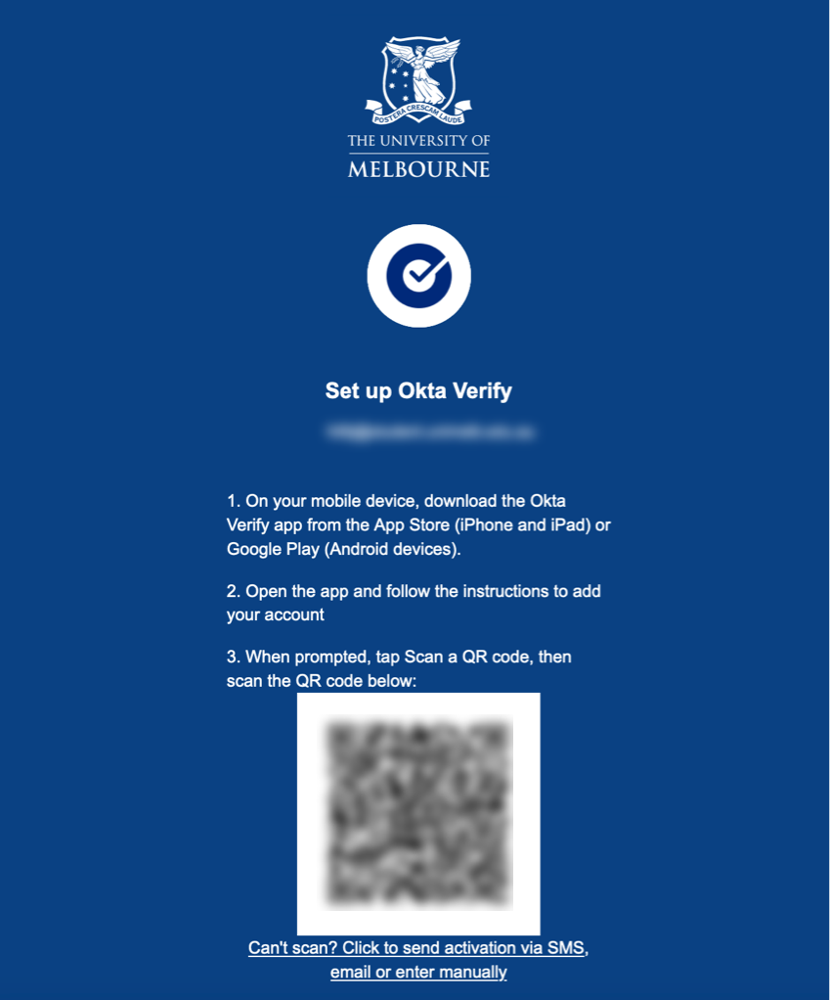

# fuckoffokta

> Get TOPT secret from Okta QR code

I would rather use 1password than the okta app as I am lazy and don't want to walk to my phone.

Okta uses TOPT under the hood, we can extract the `sharedSecret` and then give that to 1password (or TOPT manager of your choice).

## Usage

Install dependencies into virtualenv with `pipenv install`

Activate shell `pipenv shell`

Register a new "okta" device and take a screenshot of the QR code that appears on this device registration screen:

  

Run:

`python3 getTOPT.py <okta_qr_code_image>`

Add the TOPT secret that appears to your password manager.
(For 1password, add the secret into the field that appears under `edit > add more > one time password`)